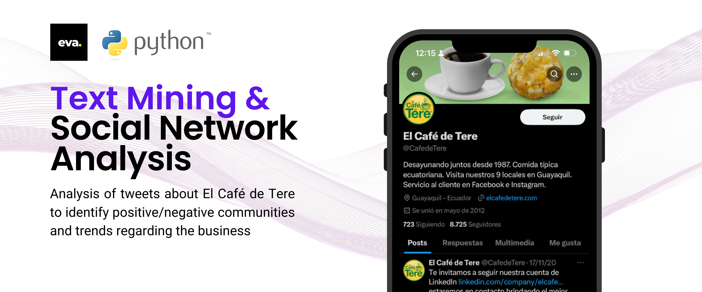
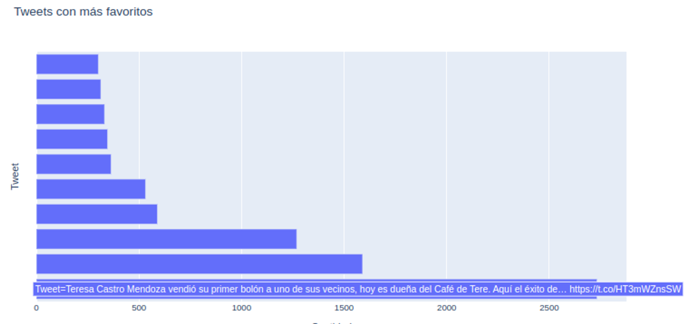
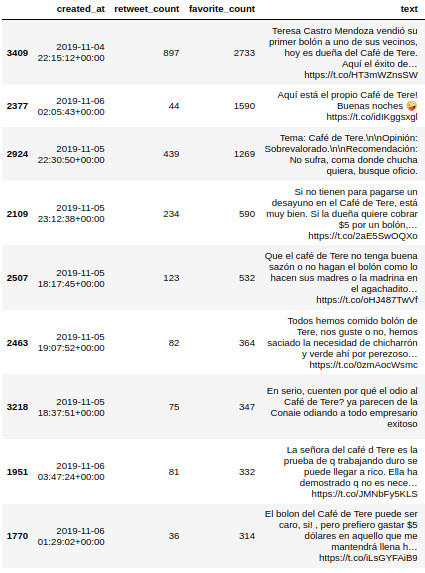

# Text Mining & Social Network Analysis

**URL de GitHub:** 

[https://github.com/edwin06111998/Text-Mining-y-Social-Network-Analysis](https://github.com/edwin06111998/Text-Mining-y-Social-Network-Analysis)

Se realizará un análisis sobre los tweets más destacados que hablan de los bolones en Guayaquil, se determinará si existen comunidades que apoyan o están en contra de los bolones de Tere. Adicional, se identificarán si existen tendencias positivas o negativas que puedan aportar valor al análisis.

### **¿Cuáles son los 10 tweets más destacados?**

Para este análisis, se incluyeron dos métricas: la cantidad de `retweets` y `favoritos`

**¿Qué es un favorito?:** Es la acción de indicar que te gusta un tweet haciendo clic en el ícono del corazón.

**¿Qué es un retweet?:** Es la acción de compartir el tweet de otra persona con tus propios seguidores.

- **Tweets con mayor cantidad de favoritos:**
    
    **El tweet más favorito es:** *Teresa Castro Mendoza vendió su primer bolón a uno de sus vecinos, hoy es dueña del Café de Tere. Aquí el éxito de… https://t.co/HT3mWZnsSW*
    
    
    
    Histograma de tweets más favoritos
    



Tweets con más favoritos

- **Tweets con mayor cantidad de retweets:**
    
    Estos son los 5 tweets más retuiteados, se removió un tweet de origen portugués, ya que, nuestro análisis se centra en tweets de idioma castellano.
    
    **Este es el tweet más retuiteado:** *RT @Anaro74: Buenos días desde un país donde:\n-El crecimiento económico es 0.0%\n-La Sria. de Gobernación dice que es legal la Ley Bonilla\n-…*
    


Tweets con más retweets


Histograma de tweets con más retweets

### **¿Qué están hablando las personas acerca del Café De Tere?**

Para este análisis se hará uso de una nube de palabras (bigramas y trigramas) que proporcionará información valiosa sobre las palabras y frases más destacadas a lo largo de todos los tweets:

- **Nube de palabras más destacadas:**
    
    La presencia de palabras como "**duena**", "**vendio**", "**primer**", "**exito**", "**hoy**", y "**opinion**" indica que los usuarios están discutiendo eventos recientes relacionados con el negocio.
    


Nube de palabras sobre los tweets

- **Trigrama:**
    
    Trigramas como "**hoy_duena_cafe**" y "**duena_cafe_tere**" indican que la dueña es una figura central en las discusiones. Hay discusiones recientes sobre la dueña del café.
    


Trigramas mas destacados en los tweets

### ¿Qué opiniones/frases se asocian a mi negocio?

**`cafe_tere_aqui`** Los usuarios están hablando de experiencias o situaciones directamente relacionadas con "El Café de Tere". Podría ser una frase como: "El café de Tere aquí es el mejor.”

**`bolon_vecinos_hoy`** Los bolones y los vecinos son temas recurrentes. Una frase podría ser: "Hoy los vecinos disfrutaron de los bolones en el café de Tere.”

**`hoy_duena_cafe`** Hay discusiones recientes sobre la dueña del café. Una frase podría ser: "Hoy la dueña del café estuvo presente y fue muy amable.”

**`duena_cafe_tere`** La figura de la dueña es central en las conversaciones. Una posible frase: "La dueña del café de Tere siempre está pendiente de los clientes.”

### **¿Cuáles son las temáticas más relevantes de los mensajes?**

Es evidente que la temática principal es el Café de Tere. Según las nube de palabras mostradas anteriormente, las temáticas principales tienen que ver con la dueña del Café de Tere, temas relacionados a su negocio, el cual empezó como un emprendimiento. Sin embargo, también existe una pequeña comunidad que se queja del negocio, la palabra *sobrevalorado* destaca en esta comunidad, también insultos  y palabras negativas.

### **¿La tendencia de opiniones es positiva o negativa?**

Según el análisis de sentimientos de los comentarios, se tiene como resultado que: *la mayor parte de los comentarios están cercanos a 0.* En la escala, **mientras más cercano al 0 esté el valor, se considerará como negativo, por otro lado, mientras esté más cercano al 1, se considerará positivo. 

Aunque en la gráfica se tengan mayormente comentarios negativos, a través de los trigramas se pueden ver comentarios positivos que no son reconocidos como tal, por lo que más adelante se procede a realizar un análisis más profundo por comunidades.


Distribución de los sentimientos en los comentarios

```python
print(sentiment.sentiment(\
"larga vida al bolon mixto\
de maduro de tere"))
 0.07579090359585741
```

### Análisis de Comunidades

Se realizó un análisis según las palabras que se emplean por cada comentario para poder identificar personas hablando temáticas en común. Se formaron comunidades con opiniones comunes, determinando 5 comunidades:


Conteos de comentarios por cluster


Proporción de comentarios por cada cluster  

**¿Hay una comunidad que me defienda?** 

De estos casos se pueden ver a 2 comunidades (**cluster # 0** y **cluster # 2**)en las que sus comentarios son enfocados al sabor y ademas sobre la historia de éxito que tiene el local y la señora Tere.

De estas de aquí se las puede tomar como comunidades que brindan un apoyo sobre la marca. 

Estas comunidades sobra decir corresponden a un aproximado del 30% sobre el total de los comentarios 


Trigrama de comentarios para el **cluster # 0**


Trigrama de comentarios para el **cluster # 2**

**¿Hay una comunidad que solamente me ataque?**

Sobre una comunidad que tenga su objetivo en atacar a la marca, se tiene al **cluster # 4**

En este se puede encontrar desde opiniones con desaprobación o comentarios vulgares hacia el negocio y otros usuarios


Trigrama de comentarios para el **cluster # 4**

### Conclusiones:

1. En base a la clasificación por comunidades, se ha podido determinar que el `clúster #3` hace mención a la cantidad abundante de personas que visitan el local de Garzota, destacando palabras como: local, garzota, reventar.

---

*Se hizo una clasificación de usuarios en base a la descripción de los perfiles más destacados por cada clúster, teniendo como resultado lo siguiente:*

1. El `clúster #2` comprende perfiles más adultos/profesionales, sus comentarios son positivos y están orientados al negocio, el emprendimiento y demás.


Nube de palabras para perfiles del **cluster # 2** 

---

1. El `clúster #0` comprende perfiles de influencers, de la misma manera, sus comentarios son positivos.


Nube de palabras para perfiles del **cluster # 0**

---

1. El `clúster #1` comprende perfiles jóvenes/estudiantiles. Sus comentarios están orientados al costo del producto. Se podrían considerar comentarios positivos cercanos a neutros.
    
    
    
    Nube de palabras para perfiles del **cluster # 1**
    

*Frases destacadas del clúster #1:*


Trigrama de comentarios del **cluster # 1**

### Recomendaciones:

- Respecto a la conclusión #1, se recomienda realizar un análisis logístico y financiero para evaluar la opción de optimizar el servicio durante las horas pico en las que existe una alta cantidad de afluencia en el local de Garzota.
- Se recomienda potenciar la interacción con los usuarios del **clúster #0**, debido a que estos son mayormente influencers, personas con un gran alcance mediático, con los cuales convendría entablar relaciones comerciales.
- Se recomendaría aplicar un enfoque nuevo para aprovechar a los usuarios del **cluster # 1** y captarlos como nuevos clientes. Una forma de comenzar seria usando descuentos específicos que se apliquen para estudiantes que están en grupo.